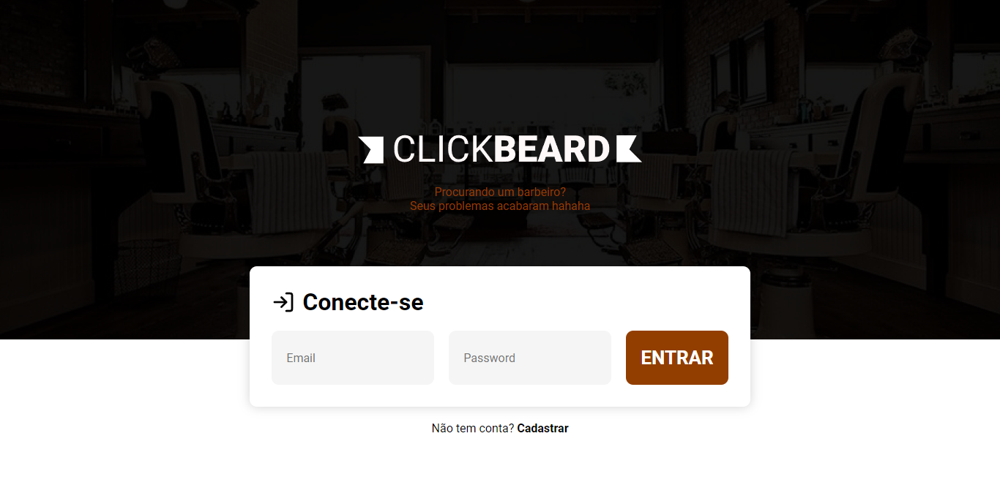
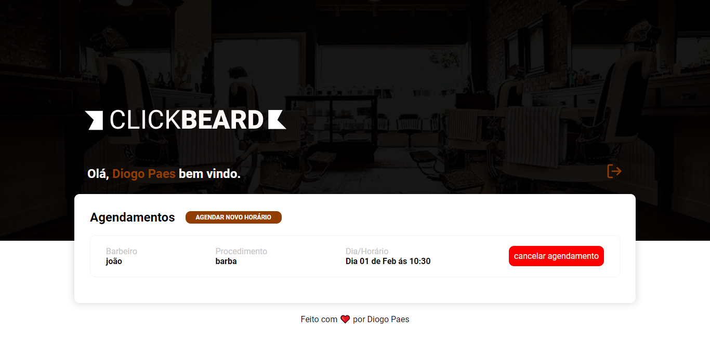

<h1 align="center">
  
  </br>
</h1>
</br>




<p align="center">

  

  <a href="https://www.linkedin.com/in/diogopaes/">
    
  </a>

  <a href="https://github.com/diogopaes/clickbeard/commits/main">
    
  </a>

  
</p>

<br>

## :dart: Sobre ##

O Projeto ClickBeard foi desenvolvido para um teste técnico, ele é um
Sistema de agendamento para barbearia.

## :dart: Design ##

O Design foi desenvolvido por min, para fins de estudo e para quem estiver querendo dar uma olhada vou deixar o link.

- [Figma](https://www.figma.com/file/bn3cFbDAti07SZ6qZISv4m/Untitled)

## :rocket: Tecnologias ##

As seguintes tecnologias foram utilizadas no projeto:

- [React.js](https://create-react-app.dev/)
- [Prismic CMS](https://prismic.io/)
- [React Hook Form](https://react-hook-form.com/)
- [Axios](https://axios-http.com/)
- [Styled Componets](https://styled-components.com/)
- [React Hot Toast](https://react-hot-toast.com/)

## :white_check_mark: Requerimentos ##

- [Node](https://nodejs.org/en/)
- [Yarn](https://yarnpkg.com/lang/en/)

## :checkered_flag: ComeçandoBack ##

```bash
# Clone this project
$ git clone https://github.com/diogopaes/clickbeard/back

# Access
$ cd clickbeard

# Install dependencies
$ yarn install

# config banco e hash
- no arquivo env

# Run the project
$ yarn dev

# The server will initialize in the <http://localhost:3001>
```

## :checkered_flag: ComeçandoFront ##

```bash
# Clone this project
$ git clone https://github.com/diogopaes/clickbeard/front

# Access
$ cd clickbeard

# Install dependencies
$ yarn install

# Run the project
$ yarn start

# The server will initialize in the <http://localhost:3000>
```

## :framed_picture: Imagens ##

<h1 align="center">
    
</h1>

</br>

♥ by Diogo Paes 👋 <a href="https://www.linkedin.com/in/diogopaes/">Talk to me!</a>
